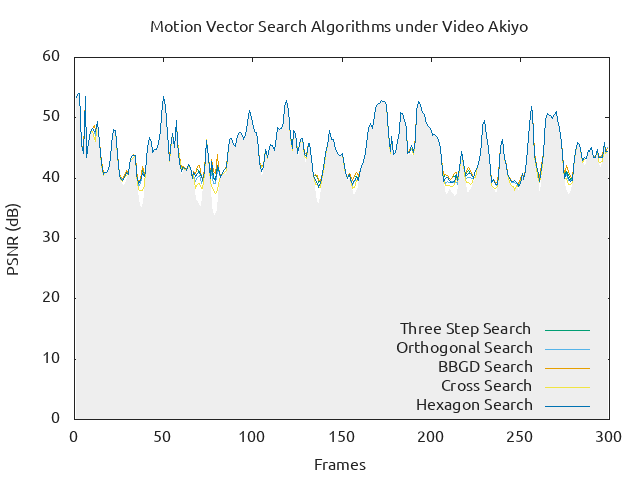
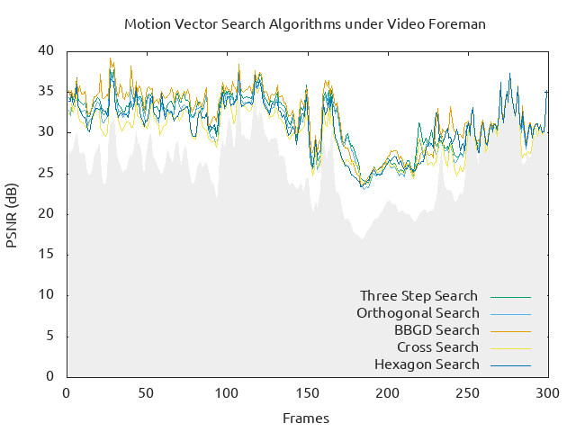
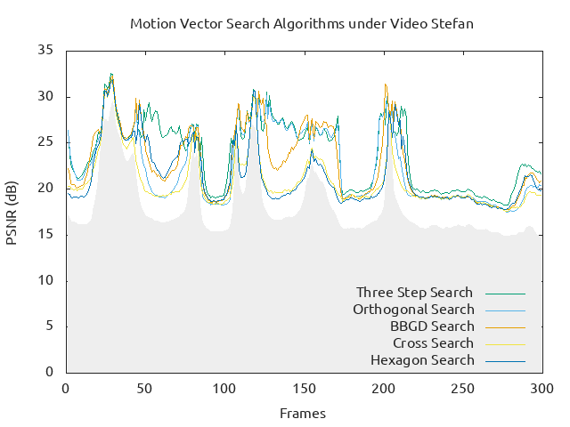
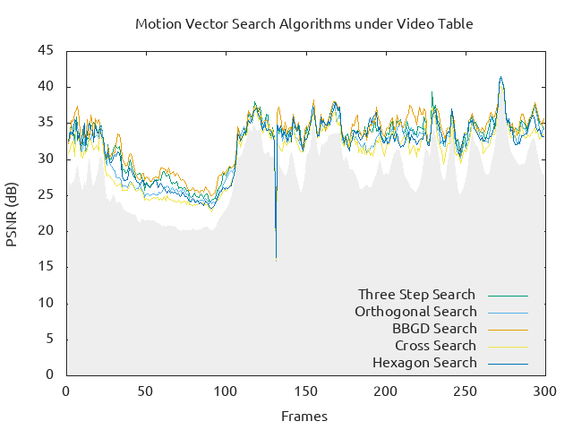

# Motion Vector Search Experiments

Homework 2 of the course Video Communication (2018 Spring).

## Compile

The source code is under the `src/` directory, You can do
```bash
make build
```
in terminal to compile the repository.

## Execute

The compiled executable is placed at `bin/hw2`. If you want to apply cross searching algorithm on the video `data/Foreman.CIF`, just do
```bash
$ bin/hw2 data/Foreman.CIF -f CIF -s cross
```

- `-f` flag specifies the video format, which can be either `CIF` or `QCIF` only.
- `-s` flag specifies the motion vector searching algorithm. Supported algorithms for now are: `three_step`, `orthogonal`, `gradient_descent`, `cross`, `hexagon`

The command above outputs the PSNR values of each frame, compared to its previous one.

## Generate Charts

It uses Gnuplot to generate the charts from the outputed logs. You can do
```bash
$ sudo apt install gnuplot5-x11
```
to install this dependency first.

Some scripts in `doc/plot` can automatically generate charts and logs for each test video and searching algorithm:
```
# Choose one of the shell scripts to perform
$ bash doc/plot/plot.bash directory/to/test/videos/
$ fish doc/plot/plot.fish directory/to/test/videos/
```
The second one needed fish the shell to be installed.

The generated logs and charts are put in `doc/plot/log` and `doc/plot/png` respectively. Here are the expected charts that generated.






Noted that the greyout area indicates no searching algorithms have applied; that is, all the motion vectors are assumed to be $(0, 0)$. All the searching algorithms are expected to have superior results than merely do nothing.
